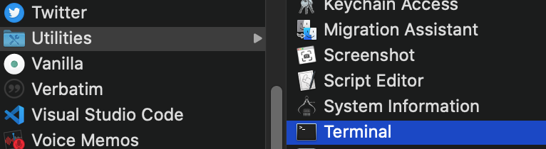
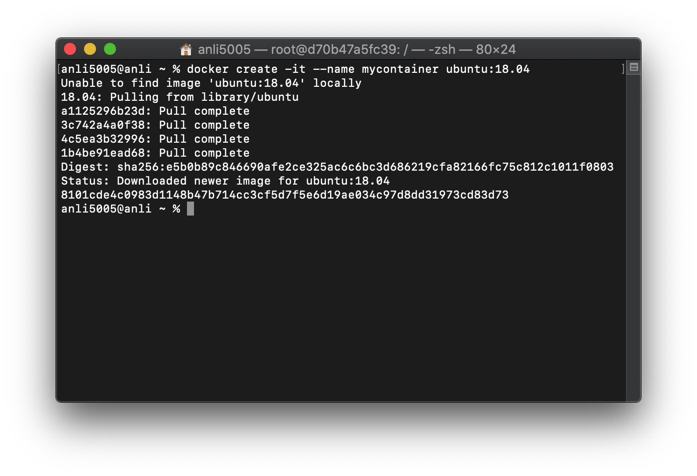
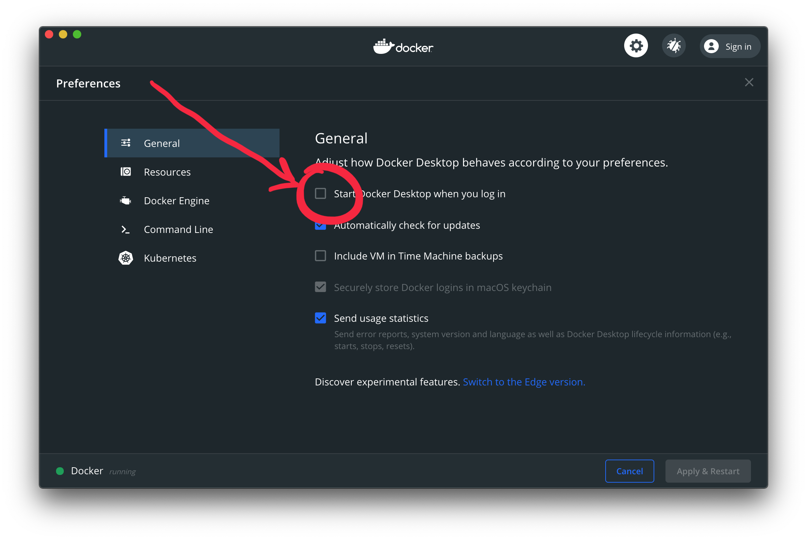
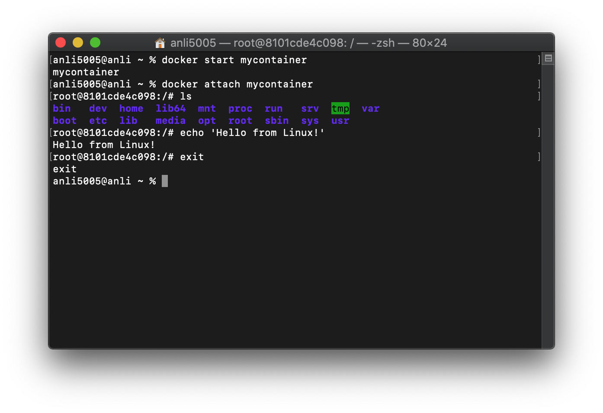
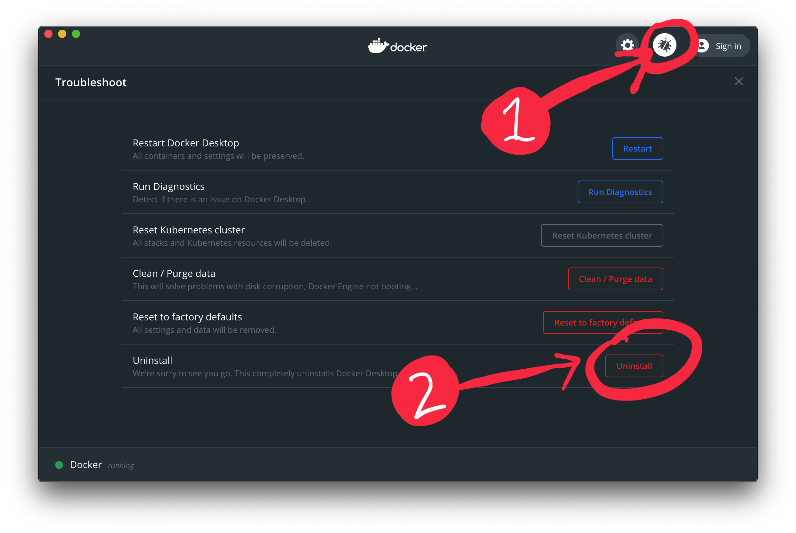

# Running Linux on a Mac with Docker
In this tutorial, we'll show you to how run Linux on a Mac.

macOS is already based on UNIX, so it runs many of the same commands as Linux. But macOS and Linux are still very different; it's impossible to take a Linux program and run it on macOS without large code changes.

Linux itself is an open-source operating system. Some of you may know it as the "hacker" OS or as a very nerdy piece of software, but it is actually used to power the majority of the world's websites and servers. Some interact with Linux over a graphical interface like you may be used to, but most use a text-based interface, like the terminal you'll be using in this tutorial. In fact, many of our CTF problems run on Linux, and our binary exploitation problems are Linux programs!

Using a technology called [Docker](https://www.docker.com), we can run a Linux container on a Mac computer. This will let you take a deeper look into some CTF problems, particularly those in the binary exploitation category.

## Setup

### 1. Installing Docker
Installing Docker itself is just like any other Mac app; head to [https://www.docker.com/products/docker-desktop](https://www.docker.com/products/docker-desktop) and click on the big blue button to download Docker.


Once downloaded, open the DMG file. When it opens, drag Docker into your Applications folder, eject the drive, and open Docker from the Applications folder. Follow the instructions to install Docker.

There should now be a Docker icon in the right of the menu bar (at the top of your screen). Click it to control and stop Docker.

### 2. Creating the container



Once Docker has started, open the Terminal application (located in the Utilities folder in Applications) and paste in this command:
```
docker create -it --name mycontainer ubuntu:18.04
```
(press the return key after pasting this command)

Docker will then download a copy of Ubuntu 18.04 and create a new container with it.



You're now done with setting up your container!

### 3. Disabling Docker Autostart (optional)
If you don't want Docker to automatically start when you log in, click on the Docker icon in your menu bar and choose **Preferences**. Then, uncheck **Start Docker Desktop when you log in** and click **Apply & Restart**.



## Using Linux

To enter your Linux environment, open your Terminal and type this:
```
docker start mycontainer
```
If you encounter an error, make sure the Docker app is running.

Then, type:
```
docker attach mycontainer
```

You should now be in the Linux shell, and you can type Linux commands and run Linux programs. From here, you can follow any Linux tutorial, move around, and interact with the Linux environment. If you don't know where to start, we recommend [Ryan's Linux Tutorial](https://ryanstutorials.net/linuxtutorial/).



When done, type `exit` or press Control-D. This will shut down the Linux container. If you want, you can quit the Docker app from the Docker icon in the menu bar.

Congratulations; you've successfully run Linux on your Mac!

## Uninstalling Docker
To uninstall Docker:
1. Click on the Docker icon in the menu bar (launch the Docker app if you haven't done so already).
2. Click **Preferences**.
3. Click on the bug icon at the top-right corner of the Docker preferences window.
4. Click the **Uninstall** icon.



## Help! I'm Stuck!
Feel free to contact the CS Camp CTF staff over email and we'll help you figure out any problems you may run into.

Enjoy CS Camp, and have a nice summer!
