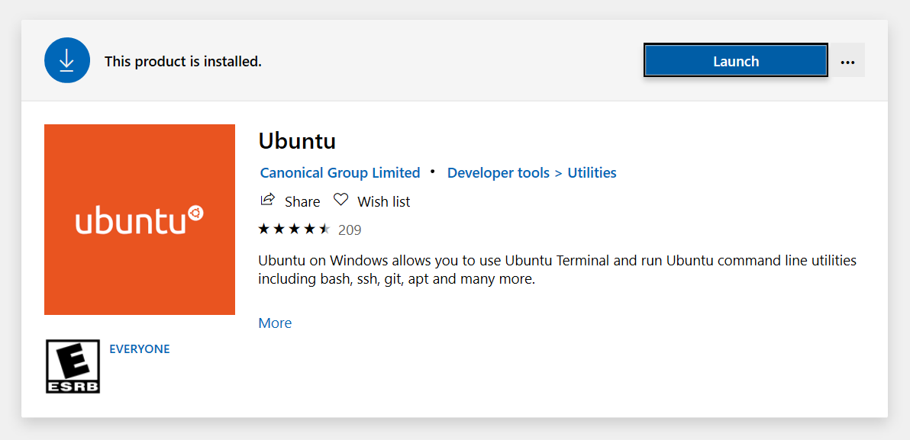

# Running Linux on Windows

Linux is an open-source operating system.
Some of you may know it as the "hacker" OS or as a very nerdy piece of software, but it is actually used to power the majority of the world's websites and servers.
Some interact with Linux over a graphical interface like you may be used to, but most use a command line interface, like the terminal you'll be using in this tutorial, to use Linux.
In fact, many of our CTF problems run on Linux, and our binary exploitation problems are Linux programs!

Windows is a pretty cool operating system, but it can't run Linux (or mac) programs natively.
However, there is a tool that can allow you to run these programs.
The aptly named tool ~~Linux Subsystem for Windows~~ Windows Subsystem for Linux lets you run a Linux environment on your Windows computer.

## Setup

1. Launch Powershell as an Administrator. You can find this by using Windows Search.

    

1. In powershell, copy and paste the following command:
    ```
    dism.exe /online /enable-feature /featurename:Microsoft-Windows-Subsystem-Linux /all /norestart
    ```

    You should see that the WSL feature is now enabled.

    

1. Reboot your computer.

1. Install [Ubuntu](https://www.microsoft.com/en-us/p/ubuntu-1804-lts/9n9tngvndl3q) from the Windows Store.
    When it finishes installing, you should see a "Launch" button.
    Yeah, go ahead and click on that.

    

1. When you first launch WSL, you will need to create a user account.
    You can enter whatever username/password you want here.

    

1. Congratulations!
    You now have a Linux environment on your Windows computer!

    

## Next Steps

You should now be in the Linux shell, and you can type Linux commands and run Linux programs.
From here, you can follow any Linux tutorial, move around, and interact with the Linux environment.
If you don't know where to start, we recommend [Ryan's Linux Tutorial](https://ryanstutorials.net/linuxtutorial/).

### Accessing Your Existing Files

Now, if you've been following along, you might be wondering, "Gee, where are all my files?"
Your `C:\` drive will be mounted at `/mnt/c`.
You can then access any file on Windows.
For example, if I wanted to view my desktop folder at `C:\Users\ed\Desktop`, I could use `cd /mnt/c/Users/ed/Desktop`.

Does that seem like a lot of work?
You can create an alias for that command.
Type `alias name="cd path"`, where `name` is the name of your alias and `path` is the path your want to alias to.
Then when you type `name` (or whatever you used) into the terminal, it will run the `cd path` command.

To persist this change, add it to your bash config with `nano ~/.bashrc`.
Use the arrow keys to scroll to the bottom of the file, and add that alias command.
Save and close by hitting `Ctrl-X` and `Y`.
Now, when you open a new WSL terminal, you'll have the alias for quick movement!

### Downloading Files via the Command Line

You can access your Windows files from Linux, but you can also download files directly from Linux with a tool called `wget`.
To install wget, paste the command `sudo apt update -y && sudo apt install wget -y` into your Linux environment.
You will need to enter the password that you created earlier.

You can now use wget by typing in `wget url` where `url` is (you guessed it) the URL of the file you want to download.
For example, if you hypotheically wanted to download the file `http://static.bcactf.com/camp2020/file.txt`, you would use `wget http://static.bcactf.com/camp2020/file.txt`, which would download the file `file.txt` into your current directory.

### Exiting Linux

When you are done, type `exit` or hit `Ctrl-D` to exit WSL.

## Help! I'm Stuck!

Feel free to contact the CS Camp CTF staff, and we'll help you figure out any problems you might have.

Enjoy CS Camp, and have a nice summer!
